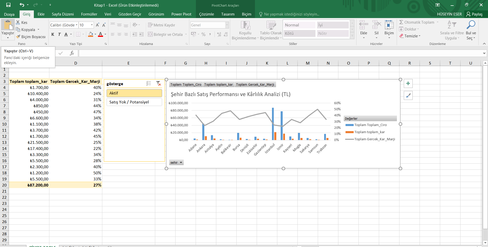
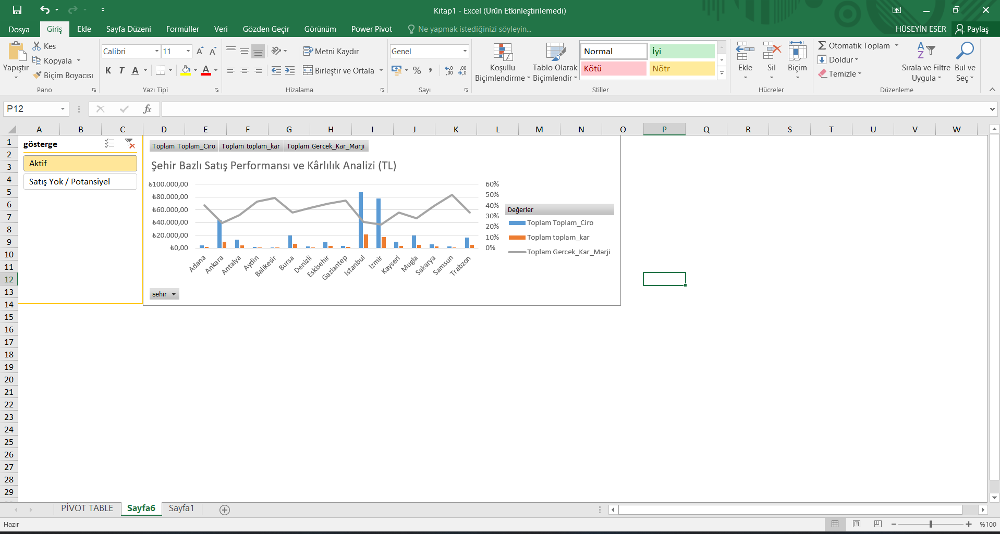

### 📈 Şehir Bazlı Satış ve Kâr Analizi (Pivot)

#### **Tablo Veri Analizi ve Stratejik Aksiyon Planı:**

* **Hacim Devleri (İstanbul):** **₺87.200** ciro ile lokomotif şehir olan İstanbul'da kâr marjı **%22** ile ortalamanın altındadır. 
    * ** Aksiyon:** İstanbul'daki yüksek rekabet ve operasyonel maliyetler (lojistik, reklam) göz önüne alınarak kurye ağları optimize edilmeli ve yüksek marjlı ürünlere yönelik hedefli reklam çalışmaları yapılmalıdır. 

* **Verimlilik Şampiyonları (Samsun & Balıkesir):** **%50** ve **%47** marj yakalayan bu iller, işletmenin en kârlı noktalarıdır. 
    * ** Aksiyon:** Bu illerdeki "düşük maliyet - yüksek kâr" modeli incelenmeli; başarının anahtarı lojistik mi yoksa ürün karması mı tespit edilerek diğer Anadolu illerine de uygulanmalıdır.

* **Risk Altındaki Bölgeler:** Marjın Türkiye ortalaması olan **%27**'nin altına düştüğü her bölge finansal alarm noktasıdır. 
    * ** Aksiyon:** %27'nin altında kalan illerde (Örn: Ankara %24, İzmir %25) birim fiyatlar gözden geçirilmeli veya bu bölgelere özel "sepet büyütme" kampanyaları uygulanarak sabit maliyetlerin kâr üzerindeki baskısı azaltılmalıdır. 

* **Genel Strateji:** Toplam kâr **₺87.200** bandındadır. 
    * ** Aksiyon:** Şirket stratejisi, İstanbul'daki pazar payını korurken, yüksek marjlı Anadolu illerindeki satış hacmini artırarak genel kâr marjını %30 seviyesine çekmek olmalıdır.
 

### 🖥️ İnteraktif Satış ve Kârlılık Dashboard (Yönetici Özeti)

#### **Dashboard Fonksiyonları ve Stratejik Karar Mekanizmaları:**

* **Dinamik Filtreleme (Slicer):** "göster" dilimleyicisi sayesinde Dashboard, saniyeler içinde "Aktif Pazarlar" ve "Potansiyel Pazarlar" arasında geçiş yapabilir. 
    * ** Aksiyon:** Pazarlama ekibi, "Satış Yok / Potansiyel" butonuna basarak doğrudan hangi illerde (Örn: Zonguldak) hiç varlık gösterilmediğini görebilir ve bu illere özel "ilk sipariş" kampanyaları planlayabilir. 

Müşteri Portföy Dağılımı ve Potansiyel Analizi: Dashboard üzerindeki görselleştirme, müşteri tabanının sadakat düzeyini anlık olarak raporlar. 

💡 Aksiyon: Portföyün %60'ını oluşturan 30 "Potansiyel Müşteri" için CRM üzerinden otomatik "hoş geldin" indirimleri tanımlanmalı; 10 kişilik "Gelişmekte Olan" grup içinse VIP segmente geçişi tetikleyecek "X tutar üzeri alışverişe hediye" kurgusu uygulanmalıdır

* **Ciro ve Marj Korelasyonu:** Sol taraftaki sütun-çizgi grafiği, hangi ilin sadece ciro odaklı, hangi ilin ise kâr odaklı çalıştığını görselleştirir. 
    * ** Aksiyon:** Grafik üzerinde kâr marjı (çizgi) düşük seyreden İstanbul gibi illerde, birim fiyat artışı yerine lojistik maliyetleri düşürecek "yerel depo" veya "toplu gönderim" stratejileri devreye alınmalıdır. 

* **Bütünsel Bakış:** Dashboard, finansal veriler (Ciro/Kâr) ile pazarlama verilerini (Segmentasyon) tek ekranda birleştirerek veri ambarındaki ham bilginin ticari karara dönüşmesini sağlar.

### 👥 Müşteri Portföyü ve Segmentasyon Analizi

#### **Müşteri Veri Analizi ve Stratejik Aksiyon Planı:**

* **Uyuyan Dev (Potansiyel Müşteriler):** Portföyün en büyük kısmını (**30 kişi**) "Potansiyel Müşteri" grubu oluşturmaktadır.Bu kitle sisteme kayıtlı olmasına rağmen henüz alışveriş yapmamıştır. 
    * ** Aksiyon:** Bu 30 kişilik dev kitle için "İlk Siparişe Özel %20 İndirim" veya "Ücretsiz Kargo" gibi karşılama kampanyaları kurgulanarak, bu kitlenin en az %20'sinin "Gelişmekte Olanlar" grubuna çekilmesi hedeflenmelidir.

* **Segment Geçiş Adayları (Gelişmekte Olanlar):** **10** kişilik bu grup, işletmeden ilk alışverişlerini yapmış ve potansiyelini kanıtlamış kitledir. 
    * ** Aksiyon:** Bu gruba, ikinci alışverişlerini tetikleyecek kişiselleştirilmiş ürün önerileri gönderilerek "Sadık Kitle" (5 kişi) segmentine geçişleri hızlandırılmalıdır. 

* **Sadakat Piramidinin Zirvesi (VIP & Şampiyon):** Toplam 50 müşteri içinde sadece **1 Şampiyon** ve **4 VIP** bulunmaktadır. Bu, gelir modelinin çok dar bir kitleye (toplamda 5 kişi) bağımlı olduğunu ve risk taşıdığını gösterir. 
    * ** Aksiyon:** Mevcut Şampiyon ve VIP müşteriler için "Ayrıcalıklı Destek Hattı" veya "Erken Erişim" gibi özel hizmetler tanımlanarak kayıp (churn) riski minimize edilmelidir. 

* **Pazar Genişleme Fırsatı:** Toplamda **50** kişilik bir veri havuzuna sahibiz. 
    * ** Aksiyon:** SQL sorguları ile bu segmentler dinamik olarak takip edilmeli; "Sadık Kitle"den "VIP"ye yükselen her müşteri için sistem otomatik bir teşekkür kuponu tanımlayarak bağlılığı pekiştirmelidir. 

